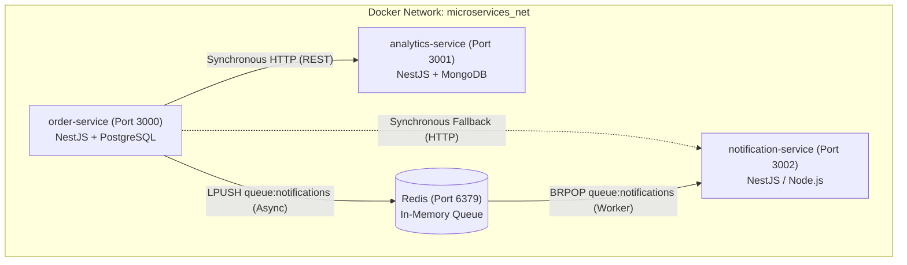

# 📬 Notification Service

Lightweight notification processing and delivery microservice designed as a core component of the distributed **Event-Driven Microservices Network**.

The service provides both a synchronous HTTP REST interface and an asynchronous task queue worker powered by **Redis**, demonstrating the transition from blocking synchronous calls to a resilient, fault-tolerant event-driven architecture.

---

## 📑 Table of Contents

- [System Architecture](#-system-architecture)
- [Key Features](#-key-features)
- [Tech Stack](#-tech-stack)
- [Environment Variables](#-environment-variables)
- [API Endpoints](#-api-endpoints)
- [Asynchronous Redis Worker](#-asynchronous-redis-worker)
- [Getting Started](#-getting-started)
  - [Prerequisites](#prerequisites)
  - [Local Development](#local-development)
  - [Docker Compose Deployment](#docker-compose-deployment)
- [Project Context & Tasks](#-project-context--tasks)

---

## 🏛 System Architecture

The service operates within an isolated Docker bridge network `microservices_net` alongside other platform services:



---

## 🚀 Key Features

1. **Synchronous Notification Processing (HTTP REST):**
   - Direct HTTP endpoint for receiving notification requests.
   - Designed for baseline benchmarking and reproducing cascading failure scenarios (connection pool exhaustion, service degradation when downstreams lag or fail).

2. **Asynchronous Buffering & Background Processing (Redis Task Queue):**
   - **Producer-Consumer / Task Queue** pattern utilizing Redis `LPUSH` and `BRPOP`.
   - Decouples notification dispatch from critical business logic flows (`order-service`).
   - Prevents cascading failures and protects request throughput during downstream delays or email gateway outages.
   - Handles traffic surges gracefully (*Spike Arresting*).

---

## 🛠 Tech Stack

- **Runtime:** Node.js (v20+) / TypeScript
- **Framework:** NestJS / Express
- **Queue / Cache:** Redis 7 (`ioredis` / `redis`)
- **Containerization:** Docker & Docker Compose
- **Network:** Docker Bridge Network (`microservices_net`)

---

## ⚙️ Environment Variables

Create a `.env` file in the root directory based on the following template:

```env
# Application Port
PORT=3002

# Redis Configuration
REDIS_HOST=localhost
REDIS_PORT=6379
REDIS_PASSWORD=

# Task Queue
NOTIFICATION_QUEUE_NAME=queue:notifications

# Environment
NODE_ENV=development
```

> [!NOTE]
> When running inside Docker Compose, set `REDIS_HOST` to the container service name: `redis`.

---

## 📡 API Endpoints

### 1. Healthcheck

- **Method:** `GET`
- **Path:** `/health`
- **Response (`200 OK`):**
  ```json
  {
    "status": "ok",
    "uptime": 124.5,
    "timestamp": "2026-09-11T18:00:00.000Z"
  }
  ```

### 2. Synchronous Notification Dispatch

- **Method:** `POST`
- **Path:** `/notifications/send`
- **Headers:** `Content-Type: application/json`
- **Request Body:**
  ```json
  {
    "orderId": "ord-12345",
    "customerEmail": "customer@example.com",
    "message": "Your order has been placed successfully!"
  }
  ```
- **Response (`200 OK` / `201 Created`):**
  ```json
  {
    "status": "SENT",
    "orderId": "ord-12345",
    "sentAt": "2026-09-11T18:00:00.000Z"
  }
  ```

---

## 📥 Asynchronous Redis Worker

The worker initiates on service startup and performs a non-busy blocking wait for tasks using `BRPOP`:

- **Queue Name:** `queue:notifications`
- **Command:** `BRPOP queue:notifications 0`
- **Task Payload:**
  ```json
  {
    "orderId": "ord-12345",
    "customerEmail": "customer@example.com",
    "message": "Your order was created!"
  }
  ```

Worker lifecycle logs:
```text
🚀 Notification Worker started, waiting for jobs...
[Worker] Processing notification for order #ord-12345
[Worker] ✅ Notification for order #ord-12345 sent to customer@example.com
```

---

## 🏁 Getting Started

### Prerequisites

- [Node.js](https://nodejs.org/) (v20 or higher)
- [Docker](https://www.docker.com/) & Docker Compose
- [Redis](https://redis.io/) (for local execution without Docker)

### Local Development

1. Install dependencies:
   ```bash
   npm install
   ```

2. Start a local Redis instance:
   ```bash
   docker run -d --name redis-local -p 6379:6379 redis:7-alpine
   ```

3. Run the development server:
   ```bash
   npm run start:dev
   ```

The service will be accessible at `http://localhost:3002`.

### Docker Compose Deployment

As part of the microservices topology, launch the service from the workspace root using `docker-compose.microservices.yml`:

```bash
docker compose -f docker-compose.microservices.yml up -d notification-service redis
```

Stream logs:
```bash
docker logs -f notification-service
```

---

## 📚 Project Context & Tasks

Detailed task descriptions, cascading failure experiments, and architectural analysis are documented in:
- [docs/task-1.md](docs/task-1.md) — *Day 10: Event-Driven — Docker Compose Network & Microservices Architecture*.
