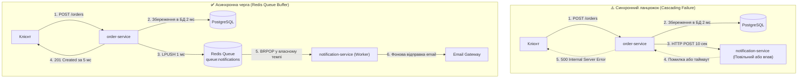

# 📘 Підсумки та Архітектурний Звіт: Завдання 1 & 2 (День 10)
## Event-Driven Architecture, Docker Compose Network та Асинхронний буфер на Redis

---

## 📑 Зміст

1. [Огляд виконаних робіт](#1-огляд-виконаних-робіт)
2. [Що таке Redis та як він працює «під капотом»](#2-що-таке-redis-та-як-він-працює-під-капотом)
3. [Архітектурна проблема: Синхронний HTTP vs Асинхронний буфер](#3-архітектурна-проблема-синхронний-http-vs-асинхронний-буфер)
4. [Висновки з проведених практичних експериментів](#4-висновки-з-проведених-практичних-експериментів)
5. [PULL vs PUSH: Чому черги рятують систему](#5-pull-vs-push-чому-черги-рятують-систему)
6. [Реалізація у стеку Docker + NestJS + ioredis](#6-реалізація-у-стеку-docker--nestjs--ioredis)
7. [Горизонтальне масштабування воркерів](#7-горизонтальне-масштабування-воркерів)
8. [Коли Redis достатньо, а коли потрібні RabbitMQ / Kafka](#8-коли-redis-достатньо-а-коли-потрібні-rabbitmq--kafka)
9. [Шпаргалка корисних команд (Cheat Sheet)](#9-шпаргалка-корисних-команд-cheat-sheet)

---

## 1. Огляд виконаних робіт

У рамках першого та другого завдань створено фундамент для переходу від тісно зв'язаної монолітної/синхронної взаємодії до надійної розподіленої системи, керованої подіями (Event-Driven):

- **Створено мікросервіс `notification-service` на NestJS:**
  - Реалізовано `GET /health` для моніторингу готовності сервісу (Docker healthcheck).
  - Реалізовано синхронний ендпоінт `POST /notifications/send` із суворою валідацією вхідних DTO через `class-validator` та `ValidationPipe`.
  - Враховано особливості TypeScript strict mode (`useUnknownInCatchVariables`).
- **Створено багатоетапний `Dockerfile`:**
  - `Build Stage` для компіляції TypeScript у JavaScript.
  - `Production Stage` на базі мінімального образу `node:20-alpine`, що містить лише компільований код та продакшн-залежності (`npm install --only=production`).
  - Додано `.dockerignore` для запобігання копіюванню локальних `node_modules` та артефактів.
- **Оркестровано спільну bridge-мережу `microservices_net`:**
  - Сервіси `notification-service` та `redis` об'єднано в ізольовану мережу.
  - Налаштовано `healthcheck` для Redis (`redis-cli ping`) та залежність `depends_on: { condition: service_healthy }`.
  - Перевірено успішний DNS-резолвінг: контейнери бачать один одного за системними іменами (`redis`, `notification-service`).
- **Підготовлено Postman-колекцію:**
  - Збережено у [docs/postman/notification-service.postman_collection.json](postman/notification-service.postman_collection.json) для швидкого тестування успішних та помилкових сценаріїв.
- **Реалізовано фоновий воркер черги задач на Redis (`NotificationWorkerService`):**
  - Використано бібліотеку `ioredis` та життєвий цикл NestJS `OnApplicationBootstrap` / `OnApplicationShutdown`.
  - Задіяно блокуюче вичитування списку `BRPOP queue:notifications 0`.

---

## 2. Що таке Redis та як він працює «під капотом»

**Redis (Remote Dictionary Server)** — це надшвидке сховище структур даних типу «ключ-значення», яке працює повністю в **оперативній пам'яті (In-Memory)**.

### Чому Redis працює так швидко (100 000+ RPS)?
1. **Дані в оперативній пам'яті (RAM):**
   - Звичайна база даних (PostgreSQL, MongoDB) повинна постійно звертатися до диска (SSD/HDD), писати у Write-Ahead Log (WAL) та скидати кеш. Час доступу до диска вимірюється в мікро- та мілісекундах.
   - Redis тримає всі активні дані в пам'яті. Час доступу до RAM — **наносекунди**!
2. **Однопотоковий Event Loop для операцій:**
   - Ядро обробки команд Redis є однопотоковим (подібно до Event Loop у Node.js).
   - Це означає, що **жодна операція не потребує блокування м'ютексів (mutex/locks)**, немає стану гонки (race conditions) всередині сховища, а кожна команда виконується атомарно.
3. **Структури даних під конкретні задачі:**
   - Redis — це не просто сховище рядків. Він підтримує:
     - **Lists (Списки):** зв'язані списки, що ідеально підходять для черг FIFO (`LPUSH`, `RPOP`, `BRPOP`).
     - **Hashes (Хеші):** аналоги об'єктів для кешування профілів, сесій.
     - **Sets & Sorted Sets:** множини з унікальними елементами та ваговими коефіцієнтами (для рейтингів, лідербордів).
     - **Streams / PubSub:** для трансляції подій.

---

## 3. Архітектурна проблема: Синхронний HTTP vs Асинхронний буфер



### Порівняльна таблиця

| Характеристика | Синхронний REST HTTP | Асинхронна черга на Redis |
| :--- | :--- | :--- |
| **Час відповіді клієнту** | Сума тривалості всіх викликів (500 мс – 10+ сек) | Час збереження в БД + 1 мс на LPUSH (5–15 мс) |
| **Зв'язок у часі** | Жорсткий (обидва сервіси мають бути доступні одночасно) | Відв'язані (сервіси працюють незалежно) |
| **Поведінка при падінні другорядного сервісу** | Замовлення зривається, клієнт отримує 500 помилку | Замовлення успішно створено, повідомлення чекає в черзі |
| **Поведінка під час пікового навантаження (Spike)** | Черги сокетів переповнюються, сервіс падає | Redis буферизує тисячі задач, воркери забирають їх по черзі |
| **Масштабованість обробки** | Обмежена пулом вхідних з'єднань веб-сервера | Довільна: просто запускаємо більше воркерів (`--scale`) |

---

## 4. Висновки з проведених практичних експериментів

### Експеримент 1: Симуляція повільного шлюзу (затримка 10 секунд)
- **Що робили:** Додали `await new Promise(r => setTimeout(r, 10000))` у метод створення сповіщення.
- **Що побачили:** Запит у Postman завис на 10.02 секунди.
- **Висновки для архітектури:** У високонавантаженій системі кілька десятків таких одночасних викликів повністю вичерпують пул доступних сокетів і потоків у Node.js/NestJS. Час очікування починає лавиноподібно накопичуватися, що призводить до відмови всієї системи (**Cascading Failure**).

### Експеримент 2: Повне падіння сервісу сповіщень (`docker stop notification-service`)
- **Що робили:** Зупинили контейнер сповіщень, після чого вкинули 3 завдання через `redis-cli lpush`.
- **Що показав Redis:** Команда `redis-cli llen queue:notifications` повернула `(integer) 3`.
- **Що сталося після рестарту (`docker start notification-service`):**
  Воркер підключився до Redis і одразу автоматично підхопив та опрацював усі 3 замовлення:
  ```text
  [Worker] Processing notification for order #ord-1 to user1@test.com
  [Worker] ✅ Notification for order #ord-1 successfully sent! (09:56:12)
  [Worker] Processing notification for order #ord-2 to user2@test.com
  [Worker] ✅ Notification for order #ord-2 successfully sent! (09:56:14)
  [Worker] Processing notification for order #ord-3 to user3@test.com
  [Worker] ✅ Notification for order #ord-3 successfully sent! (09:56:16)
  ```
- **Головний висновок:** Жодне замовлення не було втрачено! Система зберегла 100% надійності за умов відмови одного з компонентів.

---

## 5. PULL vs PUSH: Чому черги рятують систему

Принцип контролю навантаження полягає у зміні напрямку передачі задач:

* **PUSH-модель (HTTP REST):**
  Клієнт або зовнішній сервіс "штовхає" запити до отримувача незалежно від того, чи готовий той їх обробляти. Якщо прийшло 10 000 запитів — сервер отримує 10 000 одночасних ударів.
* **PULL-модель (Worker + Redis):**
  Redis нічого сам не надсилає. Воркер викликає команду `BRPOP` і **сам забирає** рівно одне завдання. Коли закінчив обробку — звертається за наступним. Сервер-обробник ніколи не отримає навантаження більше, ніж здатний витримати.

### Реальний приклад: Завантаження фотографій до оголошень (OLX / Instagram)
1. Користувач публікує оголошення та завантажує 10 фотографій високої роздільної здатності.
2. Головний бекенд зберігає дані оголошення і за 50 мс відправляє в Redis завдання:
   ```json
   {
     "adId": "ad-5544",
     "images": ["raw/photo_1.jpg", "raw/photo_2.jpg"],
     "actions": ["compress", "resize_webp", "watermark"]
   }
   ```
3. Клієнт миттєво бачить: *«Оголошення прийнято та публікується!»*.
4. Окремий фоновий Image-Worker забирає задачу, обробляє важкі файли без впливу на швидкість сайту, завантажує готові картинки на CDN і змінює статус оголошення на `ACTIVE`.

---

## 6. Реалізація у стеку Docker + NestJS + ioredis

### 1. Життєвий цикл воркера в NestJS
Для фонових задач використовуємо інтерфейси життєвого циклу NestJS:
- **`OnApplicationBootstrap`:** спрацьовує, коли всі модулі та DI-контейнер готові. Саме тут викликається запуск циклу без оператора `await`, щоб не блокувати старт HTTP-сервера:
  ```typescript
  onApplicationBootstrap() {
    this.initRedisAndStartWorker();
  }
  ```
- **`OnApplicationShutdown`:** для безпечного відключення клієнта при зупинці контейнера (`SIGTERM` / `SIGINT`).

### 2. Блокуючий метод `BRPOP`
```typescript
const result = await this.redisClient.brpop('queue:notifications', 0);
```
- Якщо черга порожня, виклик чекає (0 = нескінченний таймаут), споживаючи практично **0% ресурсів CPU**.
- Щойно в Redis робиться `LPUSH`, `BRPOP` миттєво повертає масив `[назва_черги, тіло_завдання]`.

### 3. Безпека типів у TypeScript (Strict Mode)
У блоках `catch (err)` змінна помилки має тип `unknown`. Правильний підхід для витягування повідомлення:
```typescript
const message = err instanceof Error ? err.message : String(err);
this.logger.error(`[Worker Error] ${message}`);
```

---

## 7. Горизонтальне масштабування воркерів

Якщо в черзі накопичується більше задач, ніж встигає опрацьовувати один контейнер, система масштабується однією командою:

```bash
docker compose up -d --scale notification-service=4
```

```
                     +---------------------------------------+
                     |        Redis (queue:notifications)    |
                     +---------------------------------------+
                                  |      |      |
                 +----------------+      |      +----------------+
                 |                       |                       |
                 v                       v                       v
     [ Worker Container 1 ]   [ Worker Container 2 ]   [ Worker Container 3 ]
        (Обробляє task-1)        (Обробляє task-2)        (Обробляє task-3)
```

- Redis гарантує **атомарність** операції `BRPOP`.
- Одне завдання дістанеться **рівно одному** воркеру. Дублювання задач виключено.
- Пропускна здатність обробки зростає лінійно залежно від кількості запущених контейнерів.

---

## 8. Коли Redis достатньо, а коли потрібні RabbitMQ / Kafka

Redis List — це чудове, просте та швидке рішення для базових черг завдань. Проте у складних корпоративних системах виникають вимоги, які потребують спеціалізованих брокерів повідомлень:

| Критерій | Redis (Lists: LPUSH / BRPOP) | RabbitMQ | Apache Kafka |
| :--- | :--- | :--- | :--- |
| **Основне призначення** | In-Memory кеш, черга задач, буфер | Повноцінний брокер черг повідомлень (AMQP) | Розподілений журнал подій (Event Streaming) |
| **Підтвердження доставки** | Команда забирає елемент зі списку назавжди (якщо воркер впаде посеред обробки, задача втратиться, якщо не налаштовано RPOPLPUSH) | Повноцінний механізм **ACK / NACK** (задача повертається в чергу при падінні воркера) | Контролюється зміщенням (**Offset**) споживача |
| **Dead Letter Queue (DLQ)** | Потрібно писати логіку вручну | Вбудовано з коробки (помилкові повідомлення йдуть у DLQ) | Налаштовується через окремі топіки |
| **Розсилка багатьом (Pub/Sub)** | Redis Pub/Sub не зберігає історію (повідомлення зникає, якщо підписник був офлайн) | Гнучка маршрутизація (Direct, Fanout, Topic, Headers Exchanges) | Багато споживачів читають один топік незалежно у власному темпі |
| **Збереження історії** | Дані видаляються після вичитування | Повідомлення видаляються після ACK | Історія подій зберігається тижнями/роками (Event Sourcing) |

---

## 9. Шпаргалка корисних команд (Cheat Sheet)

### Робота з чергою Redis через Docker:
```bash
# Додати нове повідомлення в початок черги:
docker exec -it redis redis-cli lpush queue:notifications '{"orderId":"ord-100","customerEmail":"user@test.com","message":"Hello"}'

# Перевірити довжину черги (кількість задач у буфері):
docker exec -it redis redis-cli llen queue:notifications

# Подивитися всі ключі в базі Redis:
docker exec -it redis redis-cli keys *

# Очистити чергу (видалити ключ):
docker exec -it redis redis-cli del queue:notifications
```

### Керування контейнерами:
```bash
# Перезбірка сервісу після змін у коді:
docker compose -f docker-compose.microservices.yml up -d --build notification-service

# Перегляд логів воркера в реальному часі:
docker logs -f notification-service

# Зупинка / Запуск сервісу для тесту відмовостійкості:
docker stop notification-service
docker start notification-service

# Масштабування кількості воркерів:
docker compose -f docker-compose.microservices.yml up -d --scale notification-service=3
```
