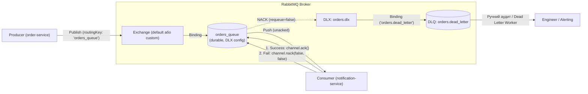

# 📘 Підсумки та Архітектурний Звіт: Завдання 1 & 2 (День 11)
## Event-Driven Architecture, RabbitMQ (AMQP 0-9-1), Manual ACK/NACK та Dead Letter Queue

---

## 📑 Зміст

1. [Огляд виконаних робіт (Executive Summary)](#1-огляд-виконаних-робіт-executive-summary)
2. [Анатомія протоколу AMQP 0-9-1: Як RabbitMQ працює «під капотом»](#2-анатомія-протоколу-amqp-0-9-1-як-rabbitmq-працює-під-капотом)
3. [Надійність доставки (Delivery Guarantees) та життєвий цикл повідомлення](#3-надійність-доставки-delivery-guarantees-та-життєвий-цикл-повідомлення)
4. [Dead Letter Queue (DLQ): Захист від Poison Messages](#4-dead-letter-queue-dlq-захист-від-poison-messages)
5. [Архітектурні особливості та підводні камені (Lessons Learned)](#5-архітектурні-особливості-та-підводні-камені-lessons-learned)
6. [Блок 4: Підготовка до технічних співбесід (Interview Q&A)](#6-блок-4-підготовка-до-технічних-співбесід-interview-qa)
7. [Алгоритмічний блок: Priority Queue на базі Binary Heap ($O(\log N)$)](#7-алгоритмічний-блок-priority-queue-на-базі-binary-heap-olog-n)
8. [Шпаргалка корисних команд (RabbitMQ Cheat Sheet)](#8-шпаргалка-корисних-команд-rabbitmq-cheat-sheet)

---

## 1. Огляд виконаних робіт (Executive Summary)

У рамках другого дня розробки сервіс сповіщень `notification-service` було переведено з примітивного опитування Redis на промисловий брокер повідомлень **RabbitMQ** за стандартом AMQP 0-9-1:

1. **Інфраструктурне розгортання RabbitMQ 3.13:**
   - Додано сервіс `rabbitmq` на базі `rabbitmq:3.13-management-alpine` у `docker-compose.microservices.yml`.
   - Прокинуто AMQP-порт `5672` (взаємодія між бекендами) та HTTP-порт `15672` (Management Web UI).
   - Інтегровано брокер у спільну ізольовану мережу `microservices_net` із налаштованим healthcheck (`rabbitmq-diagnostics check_port_connectivity`).

2. **Транспортний рівень у NestJS (`@nestjs/microservices`):**
   - Встановлено пакети `@nestjs/microservices`, `amqplib` та менеджер автоматичного відновлення з'єднань `amqp-connection-manager`.
   - Створено **гібридний додаток (Hybrid Application)** у `src/main.ts`, що одночасно приймає звичайні HTTP REST-запити (`app.listen(3002)`) та слухає чергу RabbitMQ через `app.connectMicroservice<MicroserviceOptions>()`.

3. **Гарантія доставки (At-least-once) через Manual ACK/NACK:**
   - Вимкнено автоматичний ACK (`noAck: false`).
   - У `src/notifications/notifications.controller.ts` реалізовано обробник `@EventPattern<string>('order_created')`, де повідомлення підтверджується через `channel.ack(originalMsg)` лише після успішної валідації та емуляції відправки листа.

4. **Механізм захисту від «отруйних» повідомлень (Dead Letter Queue):**
   - Чергу `orders_queue` сконфігуровано з аргументами:
     - `'x-dead-letter-exchange': 'orders.dlx'`
     - `'x-dead-letter-routing-key': 'orders.dead_letter'`
   - У разі виникнення помилки валідації (наприклад, невалідний або відсутній email) викликається `channel.nack(originalMsg, false, false)` з `requeue = false`, що миттєво відправляє некоректне повідомлення в DLQ, не зациклюючи воркер.

---

## 2. Анатомія протоколу AMQP 0-9-1: Як RabbitMQ працює «під капотом»

RabbitMQ побудовано за концепцією **«Розумний брокер — Простий споживач» (Smart Broker / Dumb Consumer)**. На відміну від черг Redis чи логів Kafka, продюсер у RabbitMQ **ніколи не надсилає повідомлення безпосередньо в чергу**. Він завжди надсилає його в **Обмінник (Exchange)**.



### Основні типи Exchanges у RabbitMQ

| Тип Exchange | Механізм маршрутизації | Приклад використання |
| :--- | :--- | :--- |
| **Direct** | Повідомлення надсилається лише в ті черги, де `Binding Key` точно збігається з `Routing Key`. | Точкова доставка задач, Dead Letter Queue (`orders.dlx` ➡️ `orders.dead_letter`). |
| **Fanout** | Широкомовна розсилка (Broadcast): ігнорує Routing Key і копіює повідомлення у **всі** прив'язані черги. | Класичний Pub/Sub: подія `UserRegistered` має піти одночасно у `EmailService`, `AnalyticsService` та `BillingService`. |
| **Topic** | Маршрутизація за шаблонами з масками: `*` (рівно одне слово), `#` (нуль або більше слів). | Складні підписки: події `order.eu.created`, `order.us.cancelled`. Черга сповіщень ЄС слухає `order.eu.*`. |
| **Headers** | Маршрутизація на основі заголовків AMQP (ключ-значення), а не рядка Routing Key. | Специфічні корпоративні сценарії з бінарними атрибутами або комбінацією умов `x-match: all/any`. |

---

## 3. Надійність доставки (Delivery Guarantees) та життєвий цикл повідомлення

### Семантика At-least-once Delivery
Коли ми вимикаємо автоматичний ACK (`noAck: false`), брокер чекає підтвердження від нашого застосунку.

```text
[Message in Queue: Ready] 
       │
       ▼ (Відправлено воркеру)
[Message in Queue: Unacked]
       │
       ├──────────────────────────────────────────────┐
       │ channel.ack()                                │ channel.nack(false, false)
       ▼                                              ▼
[Видалено з черги назавжди]              [Перенаправлено в DLX / DLQ]
```

### Чому автоматичний ACK (`noAck: true`) небезпечний у продакшені?
- При `noAck: true` RabbitMQ вважає повідомлення успішно доставленим **у ту саму мікросекунду, коли виштовхнув його в TCP-сокет**.
- Якщо процес Node.js впаде (OOM killer, segmentation fault, раптове перезавантаження контейнера) посеред обробки, **повідомлення втрачається безповоротно**.
- При `noAck: false`, якщо з'єднання розірветься до виклику `channel.ack()`, брокер автоматично поверне повідомлення зі статусу `Unacked` назад у `Ready`, і його підхопить інший живий воркер.

---

## 4. Dead Letter Queue (DLQ): Захист від Poison Messages

### Що таке «Отруйне повідомлення» (Poison Message)?
Це повідомлення із синтаксично чи логічно некоректними даними (наприклад, відсутній email клієнта або пошкоджений JSON). 
- Якщо воркер викине помилку і зробить `channel.nack(msg, false, true)` з прапорцем `requeue = true`, RabbitMQ негайно поверне це повідомлення в голову черги.
- Воркер негайно знову вичитає це повідомлення, знову кине помилку, знову зробить nack...
- **Результат:** Нескінченний шторм ретраїв (Infinite Retry Loop), 100% навантаження на CPU, переповнення дисків логами та повне блокування черги для валідних замовлень.

### Як працює зв'язка DLX + DLQ
1. На рівні черги задаються аргументи:
   - `x-dead-letter-exchange`: назва обмінника для збійних повідомлень (`orders.dlx`).
   - `x-dead-letter-routing-key`: ключ для маршрутизації в чергу помилок (`orders.dead_letter`).
2. Коли воркер фіксує помилку бізнес-валідації, він викликає:
   ```typescript
   channel.nack(originalMsg, false, false); // requeue: false
   ```
3. RabbitMQ бачить `requeue: false`, перехоплює повідомлення і через `orders.dlx` перекладає його в ізольовану чергу `orders.dead_letter`.
4. До повідомлення автоматично додається масив заголовків `x-death`:
   - `reason: "rejected"` (повідомлення було відхилено).
   - `queue: "orders_queue"` (з якої черги воно вилетіло).
   - `time`: точний Unix-таймштамп збою.

---

## 5. Архітектурні особливості та підводні камені (Lessons Learned)

У процесі налаштування та запуску ми зіткнулися з чотирма критичними інженерними нюансами, які обов'язково трапляються на реальних проектах:

### 1. Незмінність конфігурації черги (Queue Immutability)
- **Проблема:** Помилка `406 PRECONDITION_FAILED - inequivalent arg 'x-dead-letter-exchange' for queue 'orders_queue'`.
- **Причина:** Якщо чергу було створено без аргументів, AMQP забороняє змінювати її параметри на льоту.
- **Рішення:** Видалення старої черги (`Delete Queue`) у RabbitMQ UI перед повторним запуском сервісу або використання версіонування імен черг у продакшені (наприклад, `orders_queue_v2`).

### 2. Сувора типізація TypeScript 6 та NestJS 12
- **Проблема:** Помилка компіляції TS1241: `Type 'unknown' is not assignable to type 'RmqContext'`.
- **Причина:** У новій версії NestJS 12 декоратор `@EventPattern` отримав перевантаження для типізованих подій із `...args: unknown[]`, що конфліктує зі `strictFunctionTypes: true`.
- **Рішення:** Явне зазначення дженерика `@EventPattern<string>('order_created')`, що перемикає компілятор на універсальну сигнатуру `MethodDecorator`.

### 3. Конфлікт портів `EADDRINUSE: address already in use :::3002`
- **Проблема:** Локальний `npm run start:dev` впав при виклику `app.listen(3002)`.
- **Причина:** У фоні Docker продовжував працювати старий контейнер `notification-service`, який тримав порт.
- **Рішення:** Зупинка застарілого контейнера (`docker stop notification-service`) для локальної швидкої розробки з Watch Mode.

### 4. Специфіка NestJS RMQ Transport Payload
- **Проблема:** Якщо надіслати в чергу просто сирий JSON `{"orderId": 1}`, NestJS проігнорує його.
- **Причина:** NestJS вимагає обгортку з полями `"pattern"` та `"data"`, за якими внутрішній роутер мікросервісу знаходить потрібний метод-обробник.

---

## 6. Блок 4: Підготовка до технічних співбесід (Interview Q&A)

### Q1: Що таке Backpressure (зворотний тиск) і як працює `prefetch_count` (QoS) у RabbitMQ?
**Відповідь:**
- За замовчуванням RabbitMQ намагається віддати споживачу **всі** доступні в черзі повідомлення так швидко, як дозволяє мережа (Push-модель).
- Якщо в чергу раптово надійде 50 000 замовлень, брокер виштовхне їх усі в оперативну пам'ять воркера. Node.js не встигне обробити таку кількість асинхронних промісів і впаде з помилкою `JavaScript heap out of memory`.
- **`prefetch_count` (Quality of Service / QoS)** задає жорсткий ліміт: скільки непідтверджених повідомлень (`Unacked`) брокер має право одночасно тримати у даного споживача.
- Наприклад, при `prefetchCount: 10` воркер отримує 10 повідомлень, і наступне (11-те) RabbitMQ надішле лише тоді, коли воркер зробить хоча б один `channel.ack()`. Це і є реалізація **Backpressure** — регулювання швидкості постачання під швидкість обробки.

### Q2: Як працює патерн Competing Consumers і як досягти Fair Dispatch?
**Відповідь:**
- **Competing Consumers (Конкуруючі споживачі):** це запуск кількох однакових екземплярів сервісу (наприклад, 3 репліки `notification-service`), підключених до однієї черги `orders_queue`.
- RabbitMQ за замовчуванням розподіляє повідомлення між ними за принципом **Round-Robin** (по черзі: 1-му, 2-му, 3-му, знову 1-му).
- **Проблема Round-Robin:** якщо непарні замовлення прості (обробка 10 мс), а парні важкі (генерація PDF на 5 секунд), один воркер буде перевантажений, а інші простоюватимуть.
- **Рішення (Fair Dispatch):** комбінація `noAck: false` та `prefetchCount: 1`. У такому разі RabbitMQ віддає воркеру наступне завдання лише тоді, коли той повністю звільнився від попереднього.

### Q3: Порівняння: Redis vs RabbitMQ vs Apache Kafka. Коли що обирати?
**Відповідь:**

| Критерій | Redis (Lists / PubSub) | RabbitMQ (AMQP) | Apache Kafka |
| :--- | :--- | :--- | :--- |
| **Архітектурна модель** | In-Memory сховище даних | **Smart Broker / Dumb Consumer** | **Dumb Broker / Smart Consumer** |
| **Маршрутизація** | Тільки прямі ключі або канали | **Складна** (Exchanges, Topics, Direct, Headers) | Проста (за ключем партиції) |
| **Збереження даних** | До вичитування (`BRPOP` видаляє дані) | До `ACK` (після підтвердження видаляється) | **Незмінний лог (Append-only Log)** зберігається N днів |
| **Повторне читання (Replay)** | Неможливо | Неможливо (якщо не писати в окрему чергу) | **Так**, можна скинути Offset назад |
| **Пропускна здатність** | 100k+ RPS (обмежено RAM) | 20k – 50k RPS | **1 000 000+ RPS** |
| **Ідеальний кейс** | Прості фонові задачі, кеш, швидкі черги без складного роутингу. | **Транзакційні бізнес-події**, банківські операції, складний роутинг, гарантована доставка з DLQ. | **Big Data, аналітика, Event Sourcing**, телеметрія, IoT, аудит-логи. |

### Q4: Чи гарантує RabbitMQ доставку «Exactly-Once»? Як вирішується проблема дублікатів?
**Відповідь:**
- **Ні.** Жодна розподілена черга у світі не може на 100% гарантувати чистий *Exactly-once delivery* у разі збоїв мережі (теорема двох генералів). RabbitMQ гарантує **At-least-once** (щонайменше один раз).
- *Чому виникають дублікати:* воркер успішно виконав дію (наприклад, надіслав SMS), але в момент виклику `channel.ack()` моргнула мережа. Брокер не отримав ACK, повернув повідомлення в чергу, і його вичитав інший воркер.
- **Рішення:** **Ідемпотентність споживача (Idempotent Consumer)**:
  1. Кожне повідомлення повинно мати унікальний `eventId` або `idempotencyKey` (наприклад, `orderId`).
  2. Перед виконанням операції воркер перевіряє в БД / Redis: `SET lock:order:101 "processed" NX EX 86400`.
  3. Якщо ключ уже існує — воркер просто робить `channel.ack()` і пропускає повторну обробку.

---

## 7. Алгоритмічний блок: Priority Queue на базі Binary Heap ($O(\log N)$)

У високонавантажених брокерах повідомлень (таких як RabbitMQ) пріоритетні черги реалізуються на базі **двійкової купи (Binary Heap)**, а не сортованих масивів.

### Чому масив неефективний?
- Якщо тримати несортований масив: додавання $O(1)$, але пошук найвищого пріоритету вимагає повного сканування за $O(N)$.
- Якщо сортувати масив: вставка нового елемента вимагає зсуву елементів за $O(N)$ або повного сортування за $O(N \log N)$.
- **Двійкова купа (Binary Heap):** дає гарантований час $O(\log N)$ на додавання (`push`) і вилучення (`pop`), та $O(1)$ на перегляд максимального/мінімального елемента (`peek`).

### Реалізація на TypeScript:

```typescript
export interface PriorityItem<T> {
  value: T;
  priority: number; // Менше число = вищий пріоритет (Min-Heap)
}

export class PriorityQueue<T> {
  private heap: PriorityItem<T>[] = [];

  // O(1)
  get size(): number {
    return this.heap.length;
  }

  // O(1)
  isEmpty(): boolean {
    return this.heap.length === 0;
  }

  // O(1)
  peek(): T | null {
    return this.isEmpty() ? null : this.heap[0].value;
  }

  // O(log N): додаємо в кінець і просіюємо вгору
  push(value: T, priority: number): void {
    this.heap.push({ value, priority });
    this.siftUp(this.heap.length - 1);
  }

  // O(log N): міняємо корінь з останнім, видаляємо і просіюємо вниз
  pop(): T | null {
    if (this.isEmpty()) return null;
    if (this.size === 1) return this.heap.pop()!.value;

    const root = this.heap[0].value;
    this.heap[0] = this.heap.pop()!;
    this.siftDown(0);
    return root;
  }

  private siftUp(index: number): void {
    let current = index;
    while (current > 0) {
      const parent = Math.floor((current - 1) / 2);
      if (this.heap[current].priority >= this.heap[parent].priority) break;

      this.swap(current, parent);
      current = parent;
    }
  }

  private siftDown(index: number): void {
    let current = index;
    const length = this.heap.length;

    while (true) {
      let smallest = current;
      const left = 2 * current + 1;
      const right = 2 * current + 2;

      if (left < length && this.heap[left].priority < this.heap[smallest].priority) {
        smallest = left;
      }
      if (right < length && this.heap[right].priority < this.heap[smallest].priority) {
        smallest = right;
      }

      if (smallest === current) break;

      this.swap(current, smallest);
      current = smallest;
    }
  }

  private swap(i: number, j: number): void {
    [this.heap[i], this.heap[j]] = [this.heap[j], this.heap[i]];
  }
}
```

---

## 8. Шпаргалка корисних команд (RabbitMQ Cheat Sheet)

```bash
# 1. Запуск брокера RabbitMQ у Docker
docker compose -f docker-compose.microservices.yml up -d rabbitmq

# 2. Перегляд статусу та здоров'я брокера
docker exec -it rabbitmq_broker rabbitmq-diagnostics check_port_connectivity

# 3. Список черг та кількість повідомлень через rabbitmqctl
docker exec -it rabbitmq_broker rabbitmqctl list_queues name messages messages_ready messages_unacknowledged

# 4. Список активних споживачів (Consumers)
docker exec -it rabbitmq_broker rabbitmqctl list_consumers

# 5. Очищення черги від накопичених повідомлень (Purge)
docker exec -it rabbitmq_broker rabbitmqctl purge_queue orders_queue

# 6. Видалення черги (корисно при PRECONDITION_FAILED)
docker exec -it rabbitmq_broker rabbitmqadmin delete queue name=orders_queue
```
